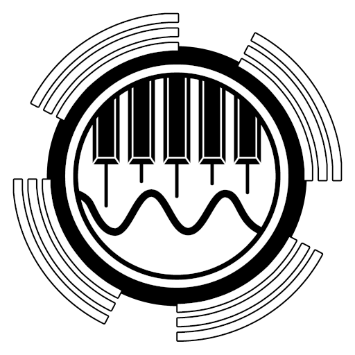
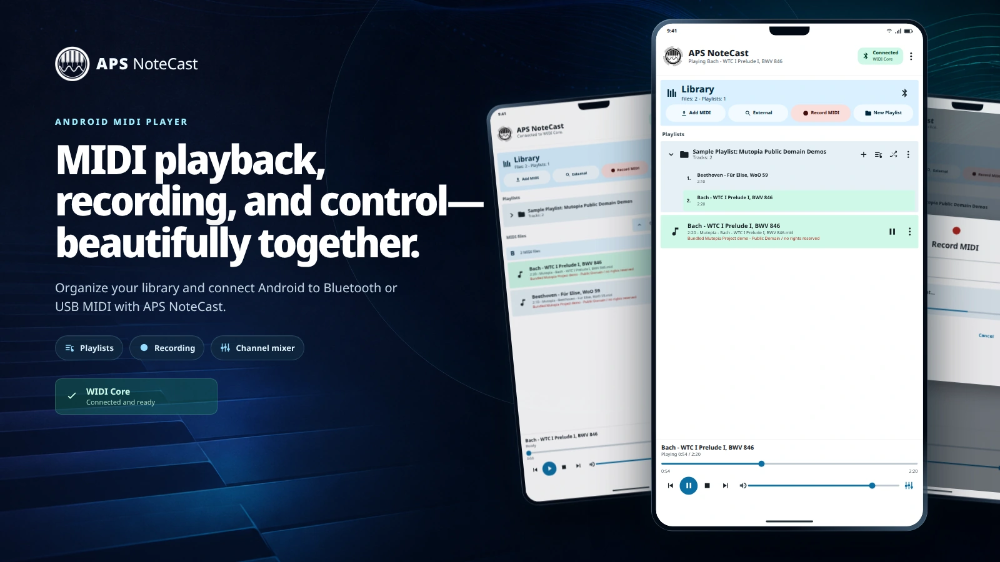
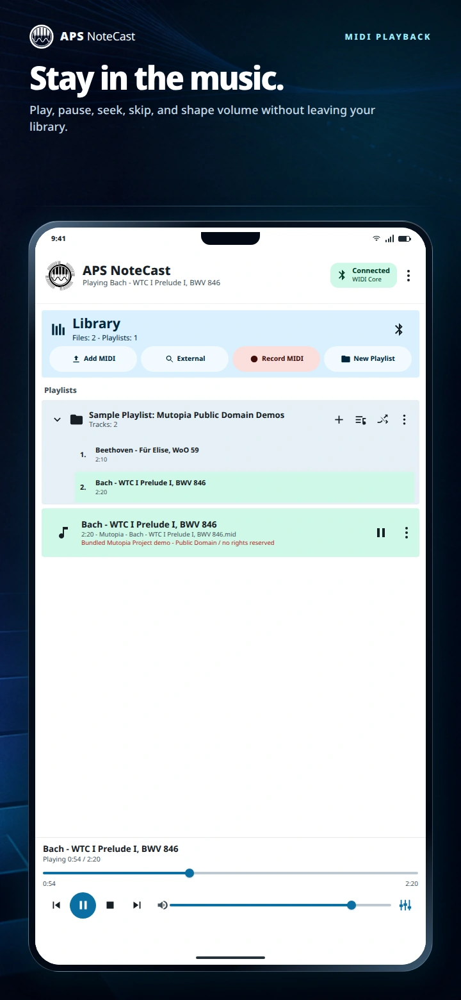
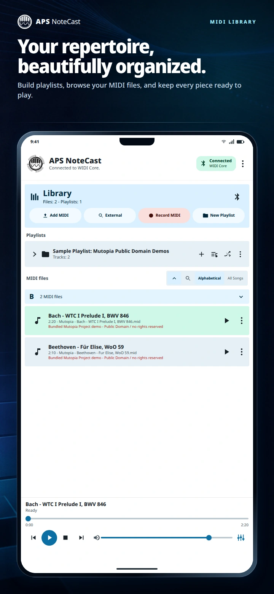
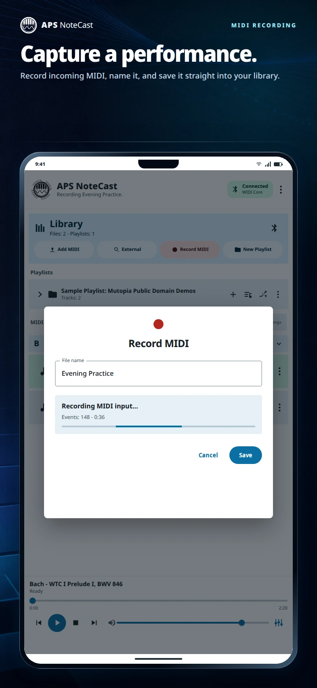
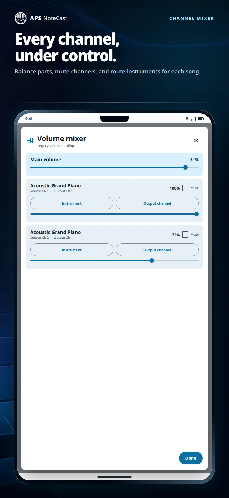
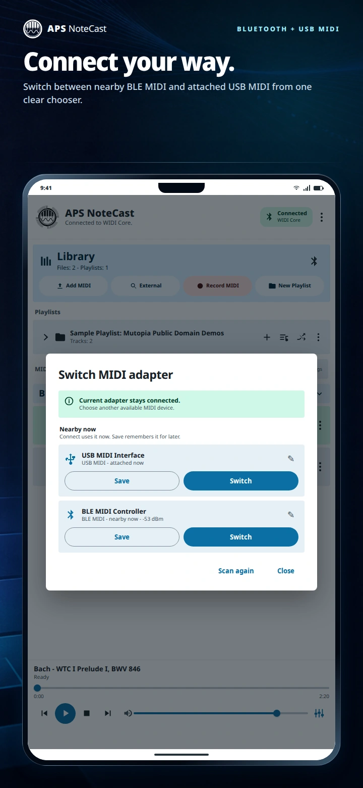

<p align="center">
  
</p>

<h1 align="center">APS NoteCast — Android MIDI Player &amp; Recorder</h1>

<p align="center"><strong>Play, organize, and record Standard MIDI Files over Bluetooth LE MIDI or USB MIDI.</strong></p>

<p align="center">
  APS NoteCast is a free, open-source Android MIDI app built for player pianos and other compatible MIDI receivers. Connect an adapter, import MIDI files, create playlists, record incoming MIDI, and keep playback within easy reach.
</p>

<p align="center">
  <a href="#what-you-can-do">Features</a> ·
  <a href="#feature-tour">Feature tour</a> ·
  <a href="#connect-and-play">Quick start</a> ·
  <a href="#build-from-source">Build</a> ·
  <a href="#documentation">Docs</a>
</p>

<p align="center">
  
  
  <a href="LICENSE"></a>
</p>



## What you can do

- **Connect over Bluetooth or USB.** Use one device picker for compatible Bluetooth LE MIDI adapters and USB MIDI devices exposed through Android's MIDI API. Save preferred adapters and reconnect quickly.
- **Play MIDI with confidence.** Play individual files or complete playlists with seek, shuffle, repeat, previous/next, tempo, transpose, and volume controls. Playback can continue through Android's foreground media service and lock-screen controls.
- **Record incoming MIDI.** Capture a performance as a Standard MIDI File with an optional visual count-in, leading-silence trim, and save-to-playlist destination.
- **Organize a local library.** Import MIDI or ZIP files, search by title, build playlists, reorder tracks, export or share individual MIDI files, and back up or restore the library.
- **Shape every performance.** Adjust per-channel volume, mute, solo, instruments, piano-channel routing, and song-specific output-channel assignments.
- **Stop cleanly.** A second tap on Stop sends pedal-off, all-sound-off, reset-controller, and all-notes-off messages across all 16 MIDI channels.

APS NoteCast has no subscriptions, in-app purchases, advertising, analytics, or paid music catalog.

## Feature tour

These illustrative interface previews are deterministic showcase renders based on the app's real Compose UI, labels, bundled demo files, and supported states.

<table>
  <tr>
    <td width="50%">
      <br>
      <p align="center"><strong>Playback that stays close</strong><br>Seek, skip, pause, stop, mix, and adjust volume without leaving the library.</p>
    </td>
    <td width="50%">
      <br>
      <p align="center"><strong>A library built around playlists</strong><br>Search MIDI files, group performances, and start sequential or shuffled playback.</p>
    </td>
  </tr>
  <tr>
    <td width="50%">
      <br>
      <p align="center"><strong>Record a performance</strong><br>See live event and duration feedback, then save the take directly to the MIDI library.</p>
    </td>
    <td width="50%">
      <br>
      <p align="center"><strong>Fine control when you need it</strong><br>Balance channels and apply per-song instrument or output routing overrides.</p>
    </td>
  </tr>
</table>

<p align="center">
  
</p>

<p align="center"><strong>Bluetooth LE MIDI and USB MIDI, together.</strong><br>Connect, switch, save, and revisit compatible adapters from one screen.</p>

## Connect and play

1. [Build and install APS NoteCast from source](#build-from-source) on a device running Android 8.0 or newer.
2. Power on a compatible BLE MIDI or USB MIDI adapter and connect it to the receiving instrument.
3. Open **MIDI adapter**, grant the requested Android permissions, and choose the device. If Android requires Bluetooth pairing, pair there and scan again in NoteCast.
4. Add a Standard MIDI File or choose one of the bundled Mutopia Project demos.
5. Start at low volume, test **Stop**, then tap **Stop** again to verify that notes and pedals release.

For setup details, saved adapters, reconnect behavior, and troubleshooting, see [Connecting MIDI hardware](docs/connecting-midi.md).

```text
Android phone → Bluetooth LE MIDI → compatible adapter → DIN MIDI → player piano
Android phone → USB MIDI → compatible receiver or adapter
```

## Compatibility

APS NoteCast uses Android's MIDI API and the standard Bluetooth LE MIDI service UUID `03B80E5A-EDE8-4B33-A751-6CE34EC4C700`. WIDI and other compatible adapters that advertise this service can be discovered from the app; USB devices appear when Android exposes them as MIDI hardware.

The app is independent and is not affiliated with CME/WIDI, Yamaha, PianoStream, PianoDisc, QRS, Steinway, or Spirio. Trademarks belong to their respective owners. Compatibility depends on the Android device, adapter, receiver, and instrument configuration; see [NOTICE](NOTICE).

## Player-piano safety

Player pianos are physical instruments. Test at low volume and confirm that Stop, second-tap Stop cleanup, pedal-off, and all-notes-off work with your exact setup before starting a long playlist or leaving the instrument unattended. Keep backups of important MIDI files and library data.

## External MIDI sources

APS NoteCast plays user-supplied files, recordings, and user-initiated downloads. External sources are clearly labeled and are not an APS NoteCast music catalog. Rights vary by source, arrangement, and sequence; download and use only files you have permission to use. See [External MIDI sources](docs/external-midi-sources.md) for rights guidance and the modular source format.

## Build from source

You need Android Studio or Android SDK 36, JDK 17, and an Android 8.0+ device or emulator.

```bash
./gradlew :app:assembleDebug :app:testDebugUnitTest :app:lintDebug
```

Install and open the debug build:

```bash
adb install -r app/build/outputs/apk/debug/app-debug.apk
adb shell am start -n com.alexanderpeppe.notecast/com.alexanderpeppe.pianobeam.MainActivity
```

See [Building and project structure](docs/building.md) for release signing, source layout, and localization details.

## Documentation

- [Connect Bluetooth LE MIDI or USB MIDI hardware](docs/connecting-midi.md)
- [Build, sign, and navigate the project](docs/building.md)
- [Configure external MIDI sources](docs/external-midi-sources.md)
- [Test on devices and player pianos](TESTING.md)
- [Contribute](CONTRIBUTING.md)
- [Changelog](CHANGELOG.md)
- [Security](SECURITY.md)
- [Third-party notices](THIRD_PARTY_NOTICES.md)

## License and policies

APS NoteCast is developed by [Alex's Piano Service LLC](https://www.alexanderpeppe.com/) and licensed under the [Apache License 2.0](LICENSE). See the [privacy policy](https://www.alexanderpeppe.com/privacy-policy/), [disclaimer](https://www.alexanderpeppe.com/disclaimer/), and [DMCA / removal policy](https://www.alexanderpeppe.com/dmca-policy/).
